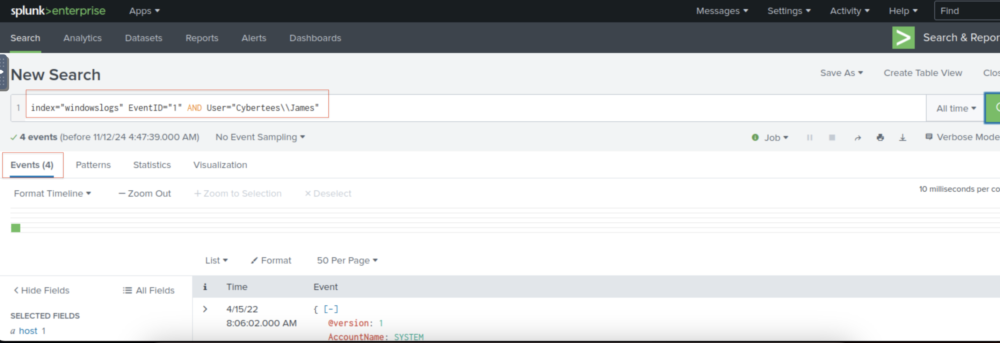
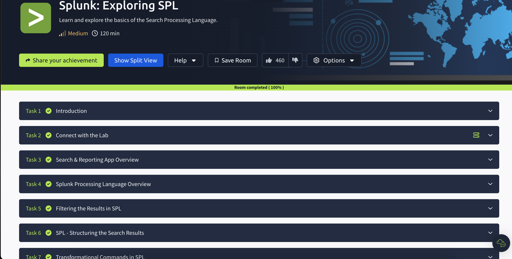

# Splunk-Exploring-Search-Processing-Language

I completed the Splunk: Exploring Search Processing Language (SPL) course on TryHackMe. Throughout the course, I gained valuable insights into filtering search results, structuring data, and using transformational commands in SPL. I learned to work with commands such as Fields, Search, Dedup, Rename, Table, Head, Tail, Sort, Reverse, Top, Rare, Highlight, Stats, Chart, and Timechart. Each of these commands has broadened my understanding of how to efficiently manipulate and analyze data in Splunk. This course has deepened my knowledge of SPL, and I’m excited to apply these skills in real-world scenarios.

## Task2 Data Summary

## Task2 Correct Answer

## Task3-1

## Task3-2

## Task3-3

## Task3 Correct Answer

## Task4-1

## Task4-2

## Task4-3

## Task4-4

## Task4-5

## Task4 Correct Answer

## Task5-1

## Task5-2

## Task5 Correct Answer

## Task6-1

## Task6-2

## Task6 Correct Answer

## Task7-1

## Task7-2

## Task7-3

## Task7 Correct Answer

## All Task Completed

